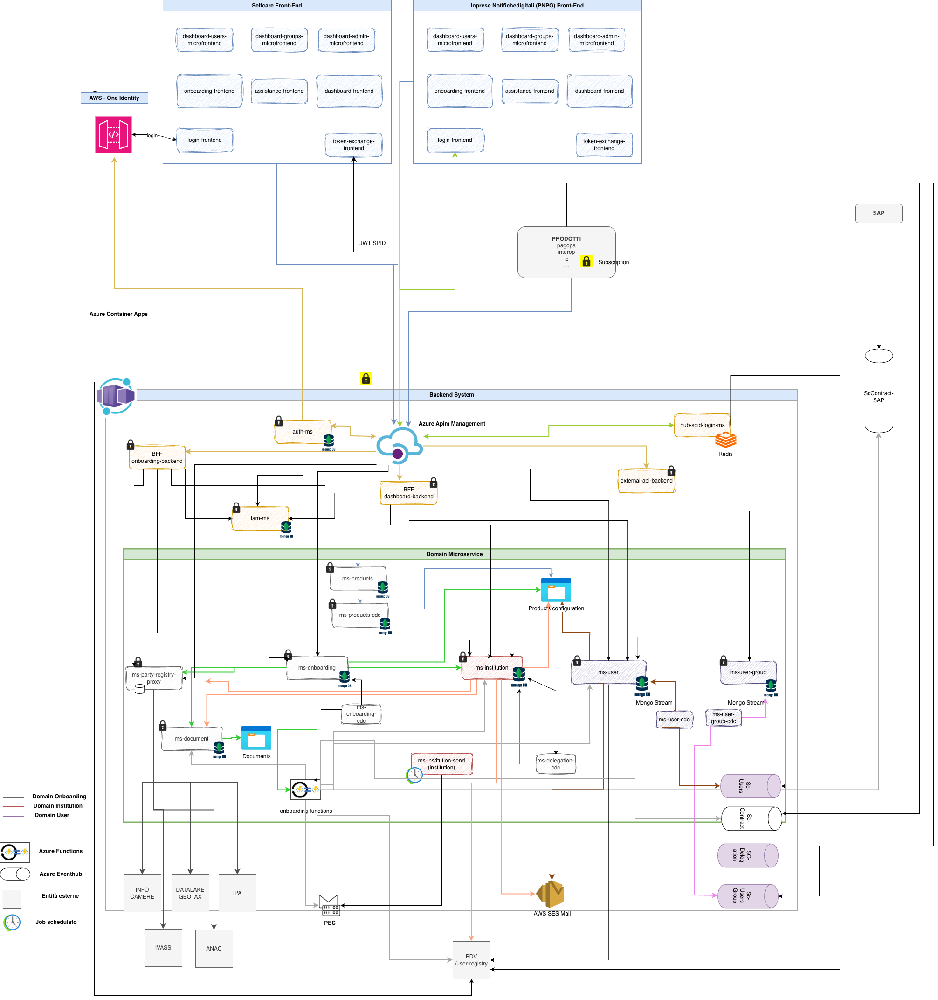

```text
  ____       _  __  ____
 / ___|  ___| |/ _|/ ___|__ _ _ __ ___
 \___ \ / _ \ | |_| |   / _` | '__/ _ \
  ___) |  __/ |  _| |__| (_| | | |  __/
 |____/ \___|_|_|  \____\__,_|_|  \___|
```

[](https://sonarcloud.io/summary/new_code?id=pagopa_selfcare)
[](https://openjdk.org/projects/jdk/17/)
[](https://maven.apache.org/)
[](https://quarkus.io/)
[](https://spring.io/projects/spring-boot)

SelfCare platform monorepo: services, SDKs, infrastructure, releases.

## Architecture



## Platform Map

| Area | Path | What lives here |
| --- | --- | --- |
| Applications | [`apps/`](apps/) | Microservices, BFFs, CDC components, functions, schedulers, and runners. |
| Libraries | [`libs/`](libs/) | Shared SDKs, parent POMs, security utilities, and test tooling. |
| Coverage | [`test-coverage/`](test-coverage/) | Aggregated JaCoCo reports and SonarCloud coverage profiles. |
| Infrastructure | [`infra/`](infra/) | Terraform resources, APIM configuration, dashboards, and operational assets. |
| Workflows | [`.github/workflows/`](.github/workflows/) | Code review, releases, drift detection, publishing, and deployment automation. |

## Runtimes

| Runtime | Version | Scope |
| --- | --- | --- |
| Java | `17` | Main runtime target. |
| Maven | `3.9.x` | Build and release orchestration. |
| Quarkus | `3.5.1` - `3.35.1` | Most backend services, with versions declared per app POM. |
| Spring Boot | `3.3.0` | `onboarding-bff` through `selc-starter-parent`. |

## Build

| Action | Command |
| --- | --- |
| Full build | `mvn clean package` |
| Full build without tests | `mvn clean package -DskipTests` |
| Build one app | `mvn -f apps/<app-name>/pom.xml clean package` |
| Test one app | `mvn -f apps/<app-name>/pom.xml test` |
| Verify one app | `mvn -f apps/<app-name>/pom.xml verify` |
| Quarkus dev mode | `mvn -f apps/<app-name>/pom.xml quarkus:dev` |

Requirements:

- Java 17
- Maven 3.9.x
- GitHub Packages access for private SelfCare artifacts
- Azure DevOps Maven feed access for SelfCare platform packages

## Quality

All pull requests and code contributions are analyzed through GitHub Actions and SonarCloud under a **single project key**: [`pagopa_selfcare`](https://sonarcloud.io/summary/new_code?id=pagopa_selfcare)

| Signal | Source |
| --- | --- |
| Quality gate | Shared code-review workflows and SonarCloud analysis. |
| Coverage | JaCoCo aggregate reports from all modules via [`test-coverage/`](test-coverage/). |
| Security scan | CodeQL workflow. |
| Drift detection | Terraform drift workflows. |

### Generate and upload coverage

**Locally** — aggregate coverage for a specific module:

```shell
# Build module with coverage
mvn --projects :test-coverage --also-make verify -P<module-name>,report -DskipITs

# Output: test-coverage/target/site/jacoco-aggregate/jacoco.xml
```

**In CI** — upload full monorepo coverage to SonarCloud:

```shell
# Step 1: Build all modules
mvn clean verify -DskipITs

# Step 2: Aggregate all jacoco.xml reports
mvn jacoco:report-aggregate -DskipTests --projects :test-coverage --also-make -Preport

# Step 3: Send to SonarCloud (single project key)
mvn sonar:sonar --projects :root --also-make \
  -Dsonar.organization=pagopa \
  -Dsonar.projectKey=pagopa_selfcare \
  -Dsonar.token=$SONAR_TOKEN
```

See [`test-coverage/README.md`](test-coverage/) for full details on the aggregation strategy.

| Flow | Workflow | Target |
| --- | --- | --- |
| Automatic DEV deploy after merge | [`trigger_deploy_after_merge.yml`](.github/workflows/trigger_deploy_after_merge.yml) | Changed apps only |
| Manual app release | [`release_app.yml`](.github/workflows/release_app.yml) | `dev`, `uat`, `prod` / `ar`, `pnpg` |
| Functions release | [`release_functions.yml`](.github/workflows/release_functions.yml) | Azure Functions apps |
| Infrastructure release | [`publish_infra.yml`](.github/workflows/publish_infra.yml) | Terraform-managed resources |
| APIM release | [`release_apim.yml`](.github/workflows/release_apim.yml) | API Management |
| OpenAPI release | [`release_open_api.yml`](.github/workflows/release_open_api.yml) | OpenAPI artifacts |
| Web assets release | [`publish_web_assets.yml`](.github/workflows/publish_web_assets.yml) | Static assets |
| Status page publish | [`publish_status_page.yml`](.github/workflows/publish_status_page.yml) | GitHub Pages/status page |
| Contracts release | [`publish_contracts_templates.yml`](.github/workflows/publish_contracts_templates.yml) | API contracts |

Current workflow status is available in [GitHub Actions](https://github.com/pagopa/selfcare/actions).

## Modules

| Domain | Modules |
| --- | --- |
| Access and identity | `auth`, `iam` |
| Institution | `institution-ms`, `institution-send-mail-scheduler`, `dashboard-bff` |
| Onboarding | `onboarding-ms`, `onboarding-bff`, `onboarding-cdc`, `onboarding-functions` |
| Products | `product`, `product-cdc` |
| Users | `user-ms`, `user-cdc`, `user-group-ms`, `user-group-cdc` |
| Documents and delegation | `document-ms`, `delegation-cdc` |
| APIs and integration | `external-api`, `webhook` |
| Registry proxy | `registry-proxy`, `registry-proxy-runner` |
| Shared libraries | `selfcare-cucumber-sdk`, `selfcare-onboarding-sdk-*`, `selfcare-sdk-*`, `selfcare-user-sdk-*` |

## Links

- [Applications](apps/)
- [Libraries](libs/)
- [Infrastructure](infra/)
- [Coverage module](test-coverage/)
- [GitHub Actions](https://github.com/pagopa/selfcare/actions)
- [Workflows](.github/workflows/)
