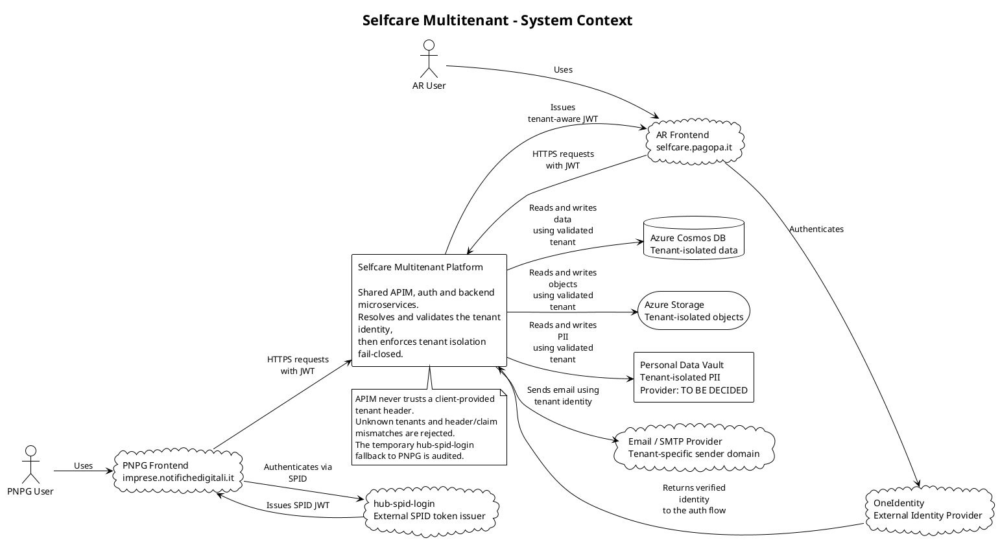
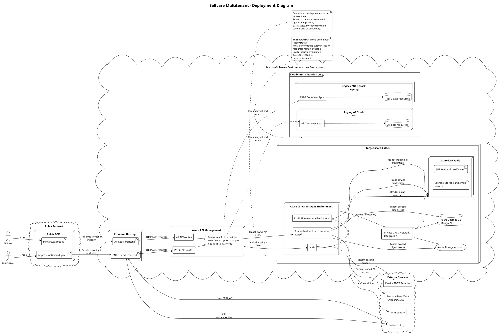
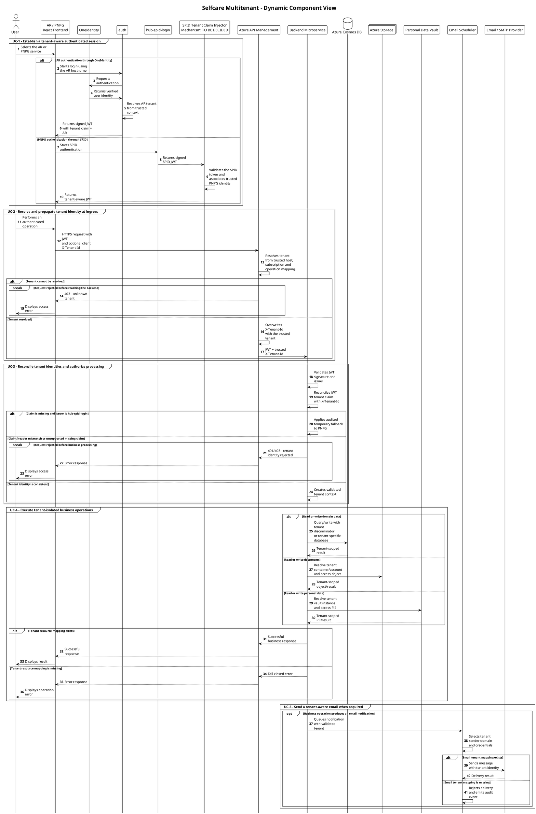

# Design Review — Multitenant Architecture (Selfcare)

> Basato sul template Confluence [Template DR](https://pagopa.atlassian.net/wiki/spaces/~693876898/pages/2019000457/Template+DR).
> Fonti: `apps/docs/Multitenant/Step_0/{REQUIREMENTS,ARCHITECTURE,SECURITY,EPIC}.md`,
> `apps/docs/Multitenant/Step_1/{REQUIREMENTS,ARCHITECTURE,SECURITY,EPIC}.md`.

| **Team** | TO BE DECIDED — team Selfcare responsabile dei microservizi in `apps/` (non specificato nei documenti sorgente) |
| --- | --- |
| **Prodotto** | Selfcare — microservizi backend condivisi tra `selfcare.pagopa.it` (AR) e `imprese.notifichedigitali.it` (PNPG) |
| **Initiative canvas** | TO BE DECIDED — nessun link fornito nei documenti sorgente |

# L'esigenza

Oggi la piattaforma Selfcare è deployata su due Azure Container App Environment separati, uno per
`selfcare.pagopa.it` e uno per `imprese.notifichedigitali.it`, ciascuno con frontend, routing APIM e
autenticazione dedicati (OneIdentity → `auth` per il primo, `hub-spid-login` per il secondo). Questo duplica
l'infrastruttura, impedisce di identificare il tenant in modo uniforme a runtime e non fornisce oggi un modo
coerente per isolare i dati (Cosmos DB, Azure Storage, vault dati personali, email) quando le due utenze
condividono lo stesso backend (`Step_0/REQUIREMENTS.md` "Project purpose"; `Step_1/REQUIREMENTS.md` "Project
purpose").

# L'esito atteso dell'iniziativa

Un singolo deployment backend per ambiente (dev/uat/prod) servirà entrambi i tenant. Ogni richiesta porterà
un'identità di tenant verificabile sia come header HTTP (`X-Tenant-Id`) sia come claim JWT, riconciliati e mai
derivati in modo indipendente a valle (SELC-1, SELC-2, `Step_0/ARCHITECTURE.md`). A livello dati, ogni
microservizio isolerà esplicitamente le informazioni del tenant in Cosmos DB, Azure Storage, vault dati
personali ed email in uscita, con comportamento fail-closed su ogni tenant non risolto (SELC-8..SELC-11,
`Step_1/ARCHITECTURE.md`). Le due infrastrutture Terraform (`-ar`/`-pnpg`) verranno consolidate tramite una
migrazione parallel-run, senza downtime, con dismissione del legacy solo dopo validazione in produzione
(`Step_0/ARCHITECTURE.md` "Deployment model").

---

# Attori del sistema

1. **USER**: utente finale autenticato tramite OneIdentity (`selfcare.pagopa.it`) o SPID via `hub-spid-login`
   (`imprese.notifichedigitali.it`).
2. **APIM**: Azure API Management, gateway condiviso che risolve il tenant dall'header `Host` e inietta/
   sovrascrive `X-Tenant-Id` prima di inoltrare al backend (SELC-5).
3. **`auth`**: microservizio interno che emette il JWT per il flusso OneIdentity, aggiungendo il claim tenant
   (SELC-4).
4. **`hub-spid-login`**: microservizio esterno "black box" che emette JWT per il flusso SPID; richiede uno
   strato di injection del claim tenant, meccanismo `TO BE DECIDED` (SELC-3).
5. **Backend microservices** (`apps/*`): consumano `X-Tenant-Id` e claim JWT già validati, applicano
   enforcement e isolamento dati (SELC-7, SELC-8..SELC-11).
6. **Cosmos DB / Azure Storage / Personal Data Vault / Email provider**: sistemi a valle su cui viene applicato
   l'isolamento per tenant.

# Casi d'uso

## Must have

1. Come **USER**, quando accedo tramite OneIdentity o SPID, voglio che la mia sessione porti un'identità di
   tenant coerente, in modo che tutte le chiamate successive vengano instradate e autorizzate correttamente
   (SELC-1, SELC-2, SELC-4).
2. Come **APIM**, quando ricevo una richiesta su uno dei due hostname noti, voglio risolvere il tenant
   dall'header `Host` e sovrascrivere `X-Tenant-Id`, in modo che il backend condiviso non si fidi mai di un
   header fornito dal client (SELC-5, anti-spoofing — `Step_0/SECURITY.md`).
3. Come **backend microservice**, quando ricevo una richiesta autenticata, voglio riconciliare l'header
   `X-Tenant-Id` con il claim JWT (default a `PNPG` solo per token `hub-spid-login` privi di claim), in modo da
   rifiutare ogni richiesta inconsistente (SELC-2.3, SELC-3.1, SELC-3.4).
4. Come **backend microservice**, quando accedo a Cosmos DB, voglio applicare il modello di isolamento scelto
   (discriminator field o database-per-tenant) usando solo il tenant già validato, in modo da non restituire mai
   dati di un altro tenant (SELC-8).
5. Come **backend microservice**, quando accedo a Azure Storage, voglio risolvere container/account solo dal
   tenant validato, in modo da non esporre blob di un altro tenant (SELC-9).
6. Come **backend microservice**, quando interrogo il vault dati personali, voglio selezionare l'istanza/tenant
   corretta, in modo da non leggere/scrivere PII di un altro tenant (SELC-10).
7. Come **backend microservice**, quando invio una email, voglio usare il dominio mittente del tenant corretto,
   in modo da non inviare comunicazioni con l'identità sbagliata (SELC-11).
8. Come **piattaforma**, quando eseguo la migrazione, voglio un rollout parallel-run (nuovo stack accanto al
   legacy, cutover solo a livello APIM), in modo da garantire zero downtime e un rollback sicuro
   (`Step_0/ARCHITECTURE.md` "Migration Strategy").

## Nice to have

1. Come **piattaforma**, voglio poter onboardare un nuovo tenant senza modificare il codice backend, in modo da
   estendere la piattaforma con costo marginale (SELC-6.2).
2. Come **operatore**, voglio un audit log esplicito per ogni fallback (`hub-spid-login` → `PNPG`) e per ogni
   rigetto per tenant sconosciuto, in modo da poter investigare anomalie (`Step_0/SECURITY.md`,
   `Step_1/SECURITY.md` — Logging & error handling).

# Vincoli normativi

TO BE DECIDED — `Step_0/REQUIREMENTS.md` e `Step_1/REQUIREMENTS.md` marcano esplicitamente questo punto come
aperto. Possibili aree da verificare: eventuali differenze di trattamento dati tra il flusso SPID
(`imprese.notifichedigitali.it`) e OneIdentity (`selfcare.pagopa.it`), vincoli di data residency per Cosmos DB/
Storage/vault per tenant.

# Caratteristiche del sistema

**Scalabilità** — Il backend condiviso deve assorbire il traffico aggregato delle due utenze legacy senza
degrado prestazionale; i numeri esatti derivano dalle analytics APIM pre-migrazione (`Step_0/ARCHITECTURE.md`
"Scale expectations" — combined baseline). Lo scaling è delegato ad Azure Container Apps (KEDA), con trigger
basati su richieste HTTP concorrenti piuttosto che soglie CPU/memoria, coerentemente con lo stack reattivo
Quarkus/Mutiny.

**Elasticità** — I repliche minime devono garantire alta disponibilità (es. ≥2 in produzione); le repliche
massime devono essere limitate per evitare l'esaurimento del connection pool verso MongoDB/Cosmos DB condiviso
(`Step_0/ARCHITECTURE.md` "Replica Bounds"). Il rate limiting per tenant a livello APIM previene il fenomeno
"noisy neighbor" in cui un tenant monopolizza le risorse condivise (SELC-5, `Step_0/ARCHITECTURE.md` "Tenant
Protection").

**Extensibility** — La strategia di risoluzione tenant deve coprire almeno i due tenant noti (AR, PNPG) ed
essere estendibile a nuovi tenant senza modifiche al codice di risoluzione (SELC-6.2); analogamente,
l'inventario dei modelli di isolamento dati (Cosmos DB, Storage) deve poter accogliere nuovi
tenant/microservizi senza ridisegnare l'architettura (SELC-8.6, SELC-9.6).

**Recoverability** — Ogni componente di risoluzione/isolamento tenant deve fallire in modo esplicito
("fail-closed") quando il tenant non è risolvibile, piuttosto che degradare silenziosamente su un tenant di
default (SELC-1.3, SELC-3.1/3.4, SELC-8.4, SELC-9.4, SELC-10.2, SELC-11.2). La migrazione parallel-run consente
un rollback sicuro mantenendo il legacy attivo fino a validazione in produzione.

## Service Level Objective

TO BE DECIDED — nessuna soglia numerica di disponibilità/latenza è definita nei documenti sorgente. Le baseline
di traffico (SLA per metrica di input) dipendono dalle analytics APIM pre-migrazione, non ancora raccolte
(`Step_0/ARCHITECTURE.md` "Scale expectations").

# Make or buy

TO BE DECIDED — nessuna valutazione di soluzioni "as-is"/"off the shelf" è documentata nei sorgenti (es. per il
vault dati personali, il cui provider è ancora `TO BE DECIDED` in `Step_1/ARCHITECTURE.md`).

---

# Design di alto livello

## Servizi cloud

| Cloud provider | Microsoft Azure (Azure Container Apps, Azure API Management, Azure Cosmos DB, Azure Storage, Azure Key Vault) — grounded in `infra/core/_modules/*`, `infra/resources/_modules/*` |
| --- | --- |
| Data classification | TO BE DECIDED — include PII gestita dal "Personal Data Vault" (riferimenti in `apps/onboarding-ms`, `apps/auth`); livello di classificazione non specificato nei documenti sorgente |
| DNS esposti | `selfcare.pagopa.it`, `imprese.notifichedigitali.it` (frontend); dominio APIM interno `${azurerm_api_management_custom_domain.api_custom_domain...}` (`infra/core/_modules/apim/variables.tf`) |
| Region | `westeurope` (rilevato da `infra/resources/document-ms/dev-ar/main.tf`: `whitemoss-eb7ef327.westeurope.azurecontainerapps.io`) |
| Subscription | TO BE DECIDED — ambienti noti: dev/uat/prod, per ciascuno stack `-ar`/`-pnpg` in consolidamento (`infra/resources/<app>/{dev,uat,prod}-{ar,pnpg}`) |

## Vista statica delle componenti

### Diagramma delle dipendenze (System Context)

Upstream: frontend React di `selfcare.pagopa.it` e `imprese.notifichedigitali.it` (client framework, per
`Step_0/ARCHITECTURE.md`). Downstream: OneIdentity (IdP esterno), `hub-spid-login` (issuer di token SPID
esterno/black-box), Azure Cosmos DB, Azure Storage, Personal Data Vault (provider `TO BE DECIDED`), provider
email/SMTP.

### Diagramma delle componenti (Container Diagram)

Componenti applicative note:
- **APIM**: risolve tenant da `Host`, inietta `X-Tenant-Id`, applica rate limiting per tenant. API: nessuna
  esposta direttamente, agisce da reverse proxy/gateway.
- **`auth`** (Quarkus): emette JWT con claim tenant per il flusso OneIdentity. Owner dei dati: sessione/claims.
  Attori: USER via OneIdentity.
- **`hub-spid-login`** + strato di injection (da progettare): emette/arricchisce JWT per il flusso SPID. Owner
  dati: sessione/claims. Attori: USER via SPID.
- **Backend microservices** (`apps/*`, Quarkus reattivo): enforcement tenant, isolamento dati Cosmos DB/
  Storage/vault/email. Specifiche OpenAPI: `src/main/docs/` per app (convenzione di repository).
- **Cosmos DB** (Mongo API): datastore primario, isolamento via discriminator field o database-per-tenant
  (SELC-8).
- **Azure Storage**: blob/file, isolamento via container o account per tenant (SELC-9).
- **Personal Data Vault**: PII, selezione istanza per tenant (SELC-10); provider `TO BE DECIDED`.
- **Email/SMTP provider**: invio tenant-aware (SELC-11); servizio noto: `institution-send-mail-scheduler`.

```plantuml
@startuml selfcare-multitenant-container-diagram
!theme plain

title Selfcare Multitenant - Container Diagram

left to right direction
skinparam shadowing false
skinparam componentStyle rectangle
skinparam wrapWidth 220
skinparam maxMessageSize 120

actor "AR User" as ar_user
actor "PNPG User" as pnpg_user

cloud "OneIdentity\nExternal Identity Provider" as one_identity
cloud "hub-spid-login\nExternal SPID token issuer" as hub_spid
rectangle "Personal Data Vault\nProvider: TO BE DECIDED" as vault
cloud "Email / SMTP Provider" as email

node "Frontend Applications" {
  component "AR Frontend\nReact\nselfcare.pagopa.it" as ar_frontend
  component "PNPG Frontend\nReact\nimprese.notifichedigitali.it" as pnpg_frontend
}

rectangle "Selfcare Multitenant Backend" {
  component "Azure API Management\n\nTrusted ingress gateway.\nResolves tenant from request context,\noverwrites X-Tenant-Id and applies\ntenant-aware rate limiting." as apim

  component "auth\nQuarkus\n\nCompletes the OneIdentity flow and\nissues JWTs with the tenant claim." as auth

  component "SPID Tenant Claim Injection\nMechanism: TO BE DECIDED\n\nAdds the trusted PNPG tenant identity\nwithout weakening SPID validation." as spid_injector

  component "Backend Microservices\nQuarkus / Mutiny - apps/*\n\nReconcile JWT claim and X-Tenant-Id,\nexecute business logic and enforce\ntenant-aware data access fail-closed." as backend

  component "institution-send-mail-scheduler\nQuarkus\n\nSelects tenant-specific sender identity\nfor queued notifications." as scheduler

  database "Azure Cosmos DB\nMongo API\n\nDiscriminator field or\ndatabase per tenant" as cosmos

  storage "Azure Storage\n\nContainer or account\nper tenant" as storage
}

ar_user --> ar_frontend : Uses
pnpg_user --> pnpg_frontend : Uses

ar_frontend --> one_identity : Starts authentication
one_identity --> auth : Returns verified identity
auth --> ar_frontend : Returns tenant-aware JWT

pnpg_frontend --> hub_spid : Starts SPID authentication
hub_spid --> pnpg_frontend : Returns SPID JWT

ar_frontend --> apim : HTTPS API requests\nwith JWT
pnpg_frontend --> apim : HTTPS API requests\nwith JWT

apim --> spid_injector : Routes eligible SPID tokens\nfor tenant claim injection
spid_injector --> backend : JWT with trusted tenant claim\nand X-Tenant-Id
apim --> backend : JWT and overwritten\nX-Tenant-Id

backend --> cosmos : Tenant-scoped queries\nand writes
backend --> storage : Tenant-scoped object\naccess
backend --> vault : Tenant-scoped PII\naccess
backend --> scheduler : Queues tenant-aware\nemail notifications
scheduler --> email : Sends with tenant-specific\ndomain and credentials

note bottom of apim
  Unknown hosts, tenants and caller mappings are rejected.
  Client-provided X-Tenant-Id values are never trusted.
end note

note bottom of backend
  The validated tenant context is the only source used
  to select Cosmos DB, Storage, vault and email resources.
end note

@enduml
```

### Diagramma dell'architettura (Deployment Diagram)

Nodi infrastrutturali noti: Azure API Management (gateway), Azure Container App Environment condiviso
(`infra/core/_modules/container_app_environments`), Azure Cosmos DB (Mongo API), Azure Storage Account(s) per
app, Azure Key Vault (secret/cert storage), DNS pubblico/privato (`infra/core/_modules/dns_public`,
`dns_private`). Stato attuale: due stack paralleli `-ar`/`-pnpg` per app/ambiente; stato target: uno stack
condiviso per ambiente, con i due legacy dismessi post-validazione (`Step_0/ARCHITECTURE.md` "Deployment
model").

## Vista dinamica delle componenti

Flusso principale (successo): USER → login (OneIdentity/`auth` o `hub-spid-login`) → JWT con claim tenant → USER
chiama frontend → richiesta HTTP verso APIM → APIM risolve tenant da `Host`, sovrascrive `X-Tenant-Id` → backend
riconcilia header/claim → backend applica isolamento dati (Cosmos DB/Storage/vault/email) usando il tenant
validato → risposta.

Flusso di fallimento: tenant non risolvibile da APIM (host sconosciuto) → rigetto esplicito, nessun default
silenzioso (SELC-1.3); claim JWT assente per token non `hub-spid-login`, o mismatch header/claim → rigetto
(SELC-2.3); tenant non mappato a Cosmos DB/Storage/vault/dominio email → fail-closed, richiesta/operazione
rigettata (SELC-8.4, SELC-9.4, SELC-10.2, SELC-11.2).

Il diagramma rappresenta questi casi d'uso dinamici:

1. **Sessione autenticata tenant-aware** — l'utente accede tramite OneIdentity per AR oppure SPID per PNPG e
   ottiene un JWT associato al tenant corretto.
2. **Risoluzione tenant all'ingresso** — APIM deriva il tenant solo da informazioni fidate, sovrascrive
   `X-Tenant-Id` e rigetta richieste non attribuibili a un tenant noto.
3. **Enforcement nel backend** — il microservizio valida firma e issuer del JWT, riconcilia claim e header e
   crea il contesto tenant; mismatch e claim mancanti non supportati vengono rifiutati.
4. **Accesso isolato ai dati** — Cosmos DB, Azure Storage e Personal Data Vault sono selezionati o filtrati
   esclusivamente tramite il tenant validato; una configurazione mancante produce un errore fail-closed.
5. **Email tenant-aware** — la notifica mantiene il tenant fino allo scheduler, che seleziona dominio mittente
   e credenziali corretti oppure blocca l'invio e genera un evento di audit.

---

# Data layer

Entità logiche note (dettaglio completo in `Step_0/REQUIREMENTS.md` "Business objects / data entities" e
`Step_1/REQUIREMENTS.md` "Business objects / data entities"):

- **Tenant registry**: elenco canonico dei tenant (`default`/AR, `PNPG`) e mapping host/path → tenant (SELC-6.3);
  meccanismo di storage `TO BE DECIDED`, candidato: APIM Named Values gestite via Terraform
  (`Step_0/ARCHITECTURE.md`).
- **JWT session token**: claim tenant, nome/formato `TO BE DECIDED` (Open Question `Step_0`).
- **`X-Tenant-Id` HTTP header**: propagato su ogni richiesta e chiamata service-to-service (SELC-1.2).
- **Cosmos DB documents**: campo discriminatore `tenantId` (modello logico) oppure database dedicato per
  tenant (modello fisico) — scelta per microservizio ancora `TO BE DECIDED` (SELC-8.6).
- **Azure Storage objects**: container per tenant in account condiviso, oppure account dedicato per tenant —
  scelta per microservizio ancora `TO BE DECIDED` (SELC-9.6).
- **Personal Data Vault tenant mapping**: provider e contratto API `TO BE DECIDED` (SELC-10.3); consumatori noti:
  `onboarding-ms`, `auth`.
- **Email sender domain mapping**: per tenant, consumatore noto `institution-send-mail-scheduler`; elenco
  completo dei microservizi che inviano email `TO BE DECIDED` (SELC-11.3).

Non è ancora presente un formato Data Contract/JSON-Schema versionato per queste entità nel repository; si
raccomanda di completarlo prima dell'implementazione, secondo la convenzione richiamata dal template DR.

## Registro `tenant_data_isolation` e naming delle variabili per-tenant

Il mapping dati per tenant sopra descritto (Cosmos DB, Storage, vault, email) è già implementato come
sorgente unica di verità in `local.tenant_data_isolation`
(`infra/resources/_modules/local-env/locals.tf`, Step_1/EPIC.md sub-task 9), consumato dai microservizi
tramite un'unica variabile d'ambiente JSON (`SELFCARE_TENANT_DATA_ISOLATION`) e la classe
`TenantDataIsolationRegistry` (`libs/selfcare-sdk-security`): ogni lookup è fail-closed e il tenant deve
essere già stato validato a monte.

**Gap identificato in fase di review** (`infra/resources/onboarding-ms/dev-pnpg/onboarding.tf`): oggi
`MONGODB-CONNECTION-STRING` e `AZURE_STORAGE_ACCOUNT_NAME` sono dichiarate con lo **stesso nome letterale**
negli stack `-ar` e `-pnpg`, ciascuna puntata a un valore diverso solo perché i due stack sono deployment
separati. Nel momento in cui `infra/resources/<app>/{dev,uat,prod}-ar`/`-pnpg` confluiranno in un unico
stack (Step_0/EPIC.md sub-task 7), una singola container app non può portare due secret/app setting sotto
lo stesso nome: ogni variabile di questo tipo deve diventare **una variabile per tenant** prima che lo
stack che la dichiara venga consolidato.

Pattern raccomandato — generalizzare il registro già costruito per il sub-task 9 invece di introdurne uno
parallelo:

1. **Terraform**: derivare i nomi dei secret/app setting per tenant da `module.local.config.tenant_data_isolation`
   con un'espressione `for`/`merge` (una voce per chiave tenant), anziché un nome scritto a mano per servizio.
   Il registro anticipa già la collisione nel Key Vault: `cosmos_connection_string_secret_name` è
   `mongodb-connection-string` per AR ma `mongodb-connection-string-pnpg` per PNPG, proprio perché entrambi
   dovranno coesistere nello stesso vault post-consolidamento. Il nome dell'account di storage non richiede
   nemmeno un secret: è già derivabile per tenant da `storage_account_infix`.
2. **Codice applicativo** (parte che Terraform da solo non risolve): sostituire la singola proprietà
   `quarkus.mongodb.connection-string` / il singolo account-name di storage con un **client selezionato per
   tenant a runtime dal `TenantId` già risolto** (`TenantContext`), non con un fetch del secret da Key Vault
   ad ogni richiesta (evita di aggiungere una dipendenza/latenza Key Vault nel percorso di richiesta, e i
   tenant noti fail-closed sono solo due):
   - Mongo: *named client* nativi di Quarkus (`quarkus.mongodb.ar.connection-string` /
     `quarkus.mongodb.pnpg.connection-string`), risolti al `ReactiveMongoClient` corretto tramite
     `@MongoClientName` all'avvio, indicizzati per `TenantId` (coerente col modello database-per-tenant già
     scelto per SELC-8).
   - Storage: una `EnumMap<TenantId, BlobServiceClient>` costruita una volta all'avvio dal nome
     account/credenziali per tenant, sullo stesso principio con cui
     `TenantDataIsolationRegistry.storageContainer(...)` deriva già il nome del container per tenant.

Questo è lavoro applicativo, non solo Terraform, e appartiene alla conversione di consolidamento di ogni
singola app (Step_0/EPIC.md sub-task 7), non al registro condiviso: è tracciato qui come prerequisito
esplicito perché non venga riscoperto app per app.

---

# Business continuity & disaster recovery

**Cosa può rompersi**: risoluzione tenant errata in APIM (redirige traffico al tenant sbagliato); mismatch
header/claim non gestito correttamente (autorizzazione errata); modello di isolamento dati misto o incompleto
per un microservizio (data leak cross-tenant); injection del claim `hub-spid-login` che indebolisce la
validazione SPID esistente; cutover APIM che interrompe il traffico durante la migrazione.

**Come si mantiene la continuità operativa**:
- Migrazione **parallel-run**: il nuovo stack condiviso viene distribuito accanto ai legacy `-ar`/`-pnpg`; il
  cutover avviene solo a livello di routing APIM; i legacy vengono dismessi solo dopo validazione in produzione
  (`Step_0/ARCHITECTURE.md` "Migration Strategy") — consente un rollback rapido riportando il routing APIM al
  legacy.
- **Fail-closed by design**: ogni componente (APIM, enforcement backend, Cosmos DB `TenantResolver`, Storage
  resolver, vault, email) rigetta esplicitamente le richieste con tenant non risolvibile, invece di degradare
  silenziosamente su un tenant di default (SELC-1.3, SELC-8.4, SELC-9.4, SELC-10.2, SELC-11.2) — riduce il
  raggio d'azione di un errore di risoluzione a un rifiuto osservabile, non a una corruzione/leak dati.
- **Segregazione dei segreti**: certificati JWT, connection string Cosmos DB, chiavi Storage e credenziali email
  restano in Azure Key Vault anche dopo il consolidamento del deployment, per non ridurre l'isolamento di trust
  tra tenant durante/dopo la migrazione (`Step_0/SECURITY.md`, `Step_1/SECURITY.md` — Secret handling).
- **Audit logging esplicito** per rigetti da mismatch tenant e per il default `hub-spid-login → PNPG`, per
  consentire investigazione post-incidente (`Step_0/SECURITY.md`, `Step_1/SECURITY.md` — Logging & error
  handling).

Piano di rollback dettagliato e RTO/RPO: `TO BE DECIDED` — non specificati nei documenti sorgente.
