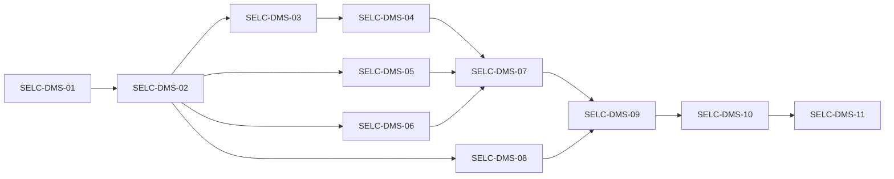

# Applicazione dello Step 2 a `apps/document-ms`

Piano di dettaglio delle modifiche necessarie per rendere `document-ms` conforme ai requisiti Step 2 ([REQUIREMENTS](REQUIREMENTS.md), [ARCHITECTURE](ARCHITECTURE.md), [SECURITY](SECURITY.md), [Database](Database_identification.md), [Storage](Storage_identification.md), [JWT](JWT_Key_Resolution.md)).
Implementazioni di riferimento già presenti nel repository: `apps/product`, `apps/onboarding-ms`, `apps/user-group-ms`, `apps/auth` ([Auth_implementation](Auth_implementation.md)).

## Convenzione degli identificativi

| Prefisso | Significato | Esempio |
|---|---|---|
| `SELC-DMS-NN` | **Storia** (epic funzionale, rilasciabile e verificabile) | `SELC-DMS-04` |
| `SELC-DMS-NN.MM` | **Task** tecnico della storia `NN` | `SELC-DMS-04.02` |
| `SELC-12` … `SELC-18` | Requisiti di [REQUIREMENTS.md](REQUIREMENTS.md) (solo riferimento, non attività) | `SELC-14.8` |

Dimensione indicativa dei task: **S** ≤ 1 gg, **M** 2–3 gg, **L** > 3 gg.

## Decisioni prese

| # | Decisione | Impatto |
|---|---|---|
| D1 | In questa fase si abilita **solo AR** (come `auth`); PNPG in una storia successiva (`SELC-DMS-11`). | `TENANT_SUPPORTED_TENANTS=AR`; nessuno stack `*-pnpg`. |
| D2 | Documenti PNPG su **storage account dedicato**. | Provisioning nuovo account + container + grant MI. |
| D3 | Template contratti **co-locati** nel binding `contracts`. | Nessuna nuova chiave logica; operazioni template tipizzate e validate. |
| D4 | `user-attachments` è **mandatory** all'avvio. | `tenant.storage.mandatory-keys=contracts,user-attachments`. |
| D5 | Firma PagoPA (Namirial/Aruba) **per tenant**. | Modifica di `selfcare-onboarding-sdk-crypto` e di `selfcare-sdk-tenant` (vedi `SELC-DMS-06`). |

## Stato attuale (gap analysis)

| Area | Stato attuale | Evidenza | Requisito |
|---|---|---|---|
| Contesto tenant | Nessun `TenantContext`; `selfcare-sdk-security` 0.3.0; nessuna dipendenza `selfcare-sdk-tenant(-mongodb)` | `pom.xml` | SELC-12.1, 12.5 |
| JWT | Chiave unica `mp.jwt.verify.publickey=${JWT_PUBLIC_KEY}` | `application.properties:6` | JWT_Key_Resolution |
| Mongo | Connection string unica, DB `selcDocument` fisso; `onStart` usa `Document.mongoDatabase()` senza tenant | `application.properties:17-18`, `DocumentMsConfig.java:33-35` | SELC-13.9–13.13 |
| Discriminatore | `Document` senza `tenantId`; query, update, delete senza filtro tenant | `DocumentRepository.java`, `DocumentServiceImpl.java:67`, `DocumentContentServiceImpl.java:256,329` | SELC-13.1 |
| Persistenza | `persist` senza tenant | `DocumentContentServiceImpl.java:380,833`, `DocumentServiceImpl.java:236,268,297` | SELC-13.1 |
| Storage | `StorageRegistry` con proprietà piatte; `null → SYSTEM` e `getOrDefault(..., SYSTEM)` = fallback implicito; un solo `AZURE_CLIENT_ID` | `StorageRegistry.java`, `application.properties:59-71` | SELC-14.1, 14.3, 14.8 |
| Template | Path del template forniti dal client, letti dal container dei contratti | `DocumentContentServiceImpl.java` (~794, 872–893) | SELC-14.5, 14.7 |
| Firma | Sorgente globale `PAGOPA_SIGNATURE_SOURCE`; credenziali lette in `static final` da `System.getenv` | `DocumentMsConfig.java:37-73`, `NamiralSignServiceImpl.java:19-20`, `NamirialHttpClient.java:14`, `ArubaInitializer.java:14-26` | SELC-17.1, 17.2 |
| Health | Readiness su singolo client/binding | `health/*ReadinessCheck.java` | SECURITY (readiness) |
| Infra | Solo `dev/uat/prod-ar`; secret piatti; nessun `TENANT_REGISTRY_JSON`; indici senza `tenantId` | `infra/resources/document-ms/*-ar/main.tf` | SELC-13.6, 17.2 |
| Chiamanti | `onboarding-functions` usa `PNPG` di default se header mancante; `JwtTenantValidator` usa `PNPG` se manca il claim | `onboarding-functions/.../TenantContext.java`, `libs/selfcare-sdk-security/.../JwtTenantValidator.java` | SELC-12.2–12.4 |

## Contratto di configurazione target (AR)

```properties
tenant.supported-tenants=${TENANT_SUPPORTED_TENANTS:AR}
tenant.enforcement.enabled=true
tenant.storage.mandatory-keys=contracts,user-attachments
tenant.registry.json=<JSON inline, senza ${...}: SmallRye non gestisce le graffe annidate>
selfcare.tenant.strict-data-isolation=${SELFCARE_TENANT_STRICT_DATA_ISOLATION:false}
mp.jwt.verify.publickey=${JWT_PUBLIC_KEY:NONE}
%test.tenant.enforcement.enabled=false
%test.tenant.storage.eager-init=false
```

```json
{
  "AR": {
    "mongo":   { "database": "selcDocument", "connectionStringEnvVar": "MONGODB_CONNECTION_STRING_AR" },
    "jwt":     { "publicKeyEnvVar": "JWT_PUBLIC_KEY_AR" },
    "storages": {
      "contracts":        { "account": "<documents-st>",  "container": "sc-<env>-documents-blob", "pathPrefix": "",
                            "authentication": { "type": "MANAGED_IDENTITY", "managedIdentityClientIdEnvVar": "AZURE_CLIENT_ID_AR_DOCUMENTS" } },
      "user-attachments": { "account": "<usrattach-st>", "container": "sc-<env>-usrattach-blob", "pathPrefix": "",
                            "authentication": { "type": "MANAGED_IDENTITY", "managedIdentityClientIdEnvVar": "AZURE_CLIENT_ID_AR_DOCUMENTS" } }
    },
    "signature": {
      "source": "namirial", "signer": "PagoPA S.p.A.", "location": "Roma",
      "namirial": { "baseUrlEnvVar": "NAMIRIAL_BASE_URL_AR", "userEnvVar": "NAMIRIAL_SIGN_SERVICE_IDENTITY_USER_AR", "passwordEnvVar": "NAMIRIAL_SIGN_SERVICE_IDENTITY_PASSWORD_AR" }
    }
  }
}
```

- La chiave logica `contracts` è la **stessa** che `product` usa già per i contract template (stesso account e container): i due servizi devono restare allineati.
- Per AR `pathPrefix=""`: i path già salvati in Mongo (`contractSigned`, `attachmentPath`, `parties/docs/...`) restano validi senza migrazione blob.
- La sezione `signature` non esiste ancora nel registry: va introdotta con `SELC-DMS-06.02`.

## Riepilogo delle storie

| Storia | Titolo | Requisiti | Dipende da | Dim. |
|---|---|---|---|---|
| SELC-DMS-01 ✅ | Dipendenze e configurazione tenant | SELC-17 | – | S |
| SELC-DMS-02 ✅ | Risoluzione del tenant per richiesta | SELC-12 | 01 | M |
| SELC-DMS-03 ✅ | Routing Mongo per tenant | SELC-13.9–13.13 | 02 | M |
| SELC-DMS-04 | Discriminatore `tenantId` e isolamento dati | SELC-13.1–13.8 | 03 | L |
| SELC-DMS-05 | Routing storage per tenant | SELC-14 | 02 | L |
| SELC-DMS-06 | Firma PagoPA per tenant | SELC-17.1–17.4 | 02 | L |
| SELC-DMS-07 | Infrastruttura Terraform AR | SELC-13.6, 17.2 | 04, 05, 06 | M |
| SELC-DMS-08 ✅ | Chiamanti e propagazione del tenant | SELC-12.2–12.4 | 02 | M |
| SELC-DMS-09 | Migrazione dati e strict mode | SELC-13.2–13.5 | 07, 08 | M |
| SELC-DMS-10 | Test end-to-end, documentazione e rilascio | SELC-18 | 09 | M |
| SELC-DMS-11 | Abilitazione PNPG (fase successiva) | SELC-12…18 | 10 | L |



---

## SELC-DMS-01 – Dipendenze e configurazione tenant ✅ Completata

**Obiettivo:** introdurre la libreria tenant e il contratto di configurazione canonico **senza cambiare il comportamento a runtime**: Mongo, storage e verifica JWT restano quelli legacy finché le storie successive non li migrano.

| Task | Stato | Descrizione | File | Dim. |
|---|---|---|---|---|
| SELC-DMS-01.01 | ✅ | `selfcare-sdk-security` 0.3.0 → 0.5.0 (non ancora indicizzata, vedi `02.02`); aggiunta `selfcare-sdk-tenant` 0.4.0 (stesse versioni di `auth`). `selfcare-sdk-tenant-mongodb` spostata in `03.01`: il suo proxy Mongo richiede un `TenantContext`, che esiste solo dopo `SELC-DMS-02`. | `pom.xml` | S |
| SELC-DMS-01.02 | ✅ | `tenant.registry.json` (solo AR: `mongo` → `selcDocument`/`MONGODB_CONNECTION_STRING_AR`, `jwt` → `JWT_PUBLIC_KEY_AR`) e `tenant.supported-tenants=${TENANT_SUPPORTED_TENANTS:AR}`. Le altre proprietà vengono aggiunte dalla storia che le usa: `enforcement` e `default` in `02`, `strict-data-isolation` in `04`, `storages` e `mandatory-keys` in `05`, `signature` in `06`. | `application.properties` | S |
| SELC-DMS-01.03 | ✅ | `TenantRegistryStartupValidator`: istanzia il registry (bean lazy) allo `StartupEvent`, così una configurazione invalida blocca l'avvio (fail-closed). Le proprietà legacy (`quarkus.mongodb.*`, `document-ms.blob-storage.*`, `mp.jwt.verify.publickey`) restano finché `03.01`, `05.03` e `02.02` non le sostituiscono. | `config/TenantRegistryStartupValidator.java` | S |
| SELC-DMS-01.04 | ✅ | Rimossa la dipendenza inutilizzata `quarkus-mailer`. | `pom.xml` | S |
| SELC-DMS-01.05 | ✅ | Infra: aggiunti i secret `MONGODB_CONNECTION_STRING_AR` e `JWT_PUBLIC_KEY_AR` (stessi secret Key Vault di quelli legacy) e `TENANT_SUPPORTED_TENANTS=AR` in dev/uat/prod-ar. I secret legacy restano fino a `07.02`. | `infra/resources/document-ms/*-ar/main.tf` | S |
| SELC-DMS-01.06 | ✅ | Test: `TenantRegistryConfigTest` (solo AR supportato, database e secret di AR, PNPG o tenant sconosciuto rifiutati); variabile `MONGODB_CONNECTION_STRING_AR` nelle proprietà di test. | `src/test/...` | S |
| SELC-DMS-01.07 | ✅ | Build CI: `selfcare-sdk-security` dichiarava `selfcare-sdk-tenant` 0.3.0, ma nel repo la libreria è 0.4.0. Con `security-sdk` 0.5.0 la libreria viene compilata nel reactor (`--also-make`), che però non contiene la 0.3.0: la build falliva. Allineato `common-sdk-tenant-version` a 0.4.0, come aveva fatto `SELC-9300` (#908). | `libs/selfcare-sdk-security/pom.xml` | S |

**Definition of Done (verificata):** `mvn -f apps/document-ms/pom.xml test` → 481 test, 0 errori (baseline 477); con `-Dtenant.supported-tenants=AR,PNPG` l'avvio fallisce con `Missing Mongo configuration for tenant PNPG`.

**Vincolo di rilascio:** applicare il Terraform di `01.05` **prima** di distribuire l'immagine; senza `MONGODB_CONNECTION_STRING_AR` l'avvio fallisce (comportamento voluto).

## SELC-DMS-02 – Risoluzione del tenant per richiesta ✅ Completata

**Obiettivo:** ogni richiesta applicativa ha un `TenantContext` validato prima di toccare qualsiasi risorsa.

| Task | Stato | Descrizione | File | Dim. |
|---|---|---|---|---|
| SELC-DMS-02.01 | ✅ | `TenantResolutionFilter` (`@Priority(AUTHENTICATION)`): legge `X-Tenant-Id`, chiama `TenantRegistry.resolve`, imposta `TenantContext` col tenant normalizzato; esclude `q` e `/q/*`. Rifiuta con `Problem` 400 `Invalid tenant context` (`application/problem+json`) header mancante, sconosciuto, ripetuto o con più valori separati da virgola. Config: `tenant.enforcement.enabled=${TENANT_ENFORCEMENT_ENABLED:true}`, `tenant.default=${TENANT_DEFAULT:AR}` (usato solo con enforcement disattivato, leva di rollout); in `%test` enforcement disattivato. | `filter/TenantResolutionFilter.java`, `filter/TenantLogUtils.java` | M |
| SELC-DMS-02.02 | ✅ | Indicizzato `selfcare-sdk-security`: attivi `JWTCallerPrincipalFactory` (chiave per tenant da `jwt.publicKeyEnvVar`, issuer ammessi `SPID`/`PAGOPA`, claim `uid` obbligatorio), `JWTSecurityIdentityAugmentor` e `JwtTenantValidationFilter` (claim `tenant_id` dei token SPID = header, altrimenti 401). `mp.jwt.verify.publickey=${JWT_PUBLIC_KEY:NONE}` resta solo come fallback legacy. | `application.properties` | S |
| SELC-DMS-02.03 | ✅ | `ExceptionHandler`: `UnknownTenantException` → 400, `UnresolvedTenantException` → 401, entrambe come `Problem` generico `Invalid tenant context` senza tenant né dettagli interni. | `exception/handler/ExceptionHandler.java` | S |
| SELC-DMS-02.04 | ✅ | Tenant risolto nell'MDC (`tenant`) e nel formato dei log (`tenant=%X{tenant}`); MDC pulito a inizio richiesta e da `TenantMdcCleanupFilter` dopo la risposta; i valori dell'header vengono sanificati prima di finire nei log. | `filter/`, `application.properties` | S |
| SELC-DMS-02.05 | ✅ | Test unitari del filtro e test `@QuarkusTest` con enforcement attivo, registry AR+PNPG e chiavi JWT distinte generate a runtime: header mancante, sconosciuto, duplicato o in conflitto col claim; token SPID senza claim; issuer o firma non validi; 40 richieste AR/PNPG concorrenti interleaved, in cui il service vede sempre il tenant della propria richiesta. | `src/test/.../filter/*`, `src/test/.../exception/handler/TenantExceptionHandlerTest.java` | M |

**Definition of Done (verificata):** `mvn -f apps/document-ms/pom.xml test` → 514 test, 0 errori (dopo 01: 481). Le IT Cucumber esistenti coprono solo `/q/health`, escluso dal filtro.

**Comportamenti osservati da tenere presenti:**

- I token SPID senza claim `tenant_id` sono attribuiti dall'SDK a `DEFAULT_TENANT` (default `PNPG`), quindi con `X-Tenant-Id: AR` ricevono 401. `auth` e `onboarding-functions` (`JwtSessionServiceImpl`) emettono già il claim; restano a rischio i token statici (`JWT_BEARER_TOKEN`) se sono SPID senza claim. Vedi `08.02` e `08.05`.
- Per i token SPID il confronto claim/header nell'SDK è case-sensitive (`ar` ≠ `AR`, risposta 401); per i token PAGOPA vale la normalizzazione del filtro. Superato da `08.05`: con `selfcare-sdk-security` 0.6.0 anche per SPID claim e header sono normalizzati (`trim` + maiuscolo).
- Rollout: con `TENANT_ENFORCEMENT_ENABLED=true` (default) i chiamanti senza `X-Tenant-Id` ricevono 400. `onboarding-ms`, `onboarding-functions` e `dashboard-bff` (`DocumentRestClientConfig` → `TenantHeaderInterceptor`, che propaga solo se l'header è presente in ingresso) lo inviano già; la verifica completa resta in `08.03`. In caso di emergenza: `TENANT_ENFORCEMENT_ENABLED=false` con `TENANT_DEFAULT=AR`.

## SELC-DMS-03 – Routing Mongo per tenant ✅ Completata

**Obiettivo:** ogni accesso Mongo usa client e database del tenant della richiesta; senza tenant non si accede a Mongo.

| Task | Stato | Descrizione | File | Dim. |
|---|---|---|---|---|
| SELC-DMS-03.01 | ✅ | Aggiunto `selfcare-sdk-tenant-mongodb` 0.3.0 (scoperto via `beans.xml`): `TenantMongoClientProducer` sostituisce il `ReactiveMongoClient` di default con un proxy per tenant (un client per tenant supportato) e `TenantMongoDatabaseResolver` sceglie il database del tenant per le entity Panache. `@MongoEntity` resta senza `clientName`/`database`. Rimossi `quarkus.mongodb.connection-string` e `quarkus.mongodb.database` (anche in test). La readiness legge database e host dal registry nello stesso commit, così l'app continua ad avviarsi. | `pom.xml`, `application.properties`, `health/DocumentMongoReadinessCheck.java` | S |
| SELC-DMS-03.02 | ✅ | Rimosso `onStart` (`Document.mongoDatabase()`) da `DocumentMsConfig`: all'avvio non c'è un tenant e il resolver fallirebbe. `TenantRegistryStartupValidator` registra nei log, per ogni tenant, il database Mongo usato. | `config/DocumentMsConfig.java`, `config/TenantRegistryStartupValidator.java` | S |
| SELC-DMS-03.03 | ✅ | `DocumentMongoReadinessCheck` esegue in parallelo un `ping` su ogni tenant supportato (ordine stabile). È UP solo se rispondono tutti; se un tenant fallisce è DOWN con `error` `Tenant <ID> ping failed: …`; senza tenant è DOWN. I dati riportano coppie `tenant=database` e `tenant=host` (host da `hostFromConnectionString`, `n/a` se non parsabile), mai connection string né credenziali. | `health/DocumentMongoReadinessCheck.java` | S |
| SELC-DMS-03.04 | ✅ | Unit test della readiness (singolo e multi-tenant, fallimento di un tenant, lookup del client che lancia un'eccezione, credenziali non esposte, nessun tenant). `@QuarkusTest` con registry AR (`selcDocument`) + PNPG (`selcDocumentPnpg`): `Document.mongoDatabase()`/`mongoCollection()` seguono il tenant della richiesta nella stessa JVM; client distinti per tenant; senza tenant `UnresolvedTenantException`; `clientForTenant("UNKNOWN")` → `IllegalStateException`; un tenant supportato senza `mongo` blocca il registry (`Missing Mongo configuration for tenant PNPG`). | `src/test/.../health/DocumentMongoReadinessCheckTest.java`, `src/test/.../repository/TenantMongoRoutingTest.java` | S |

**Definition of Done (verificata):** `mvn -f apps/document-ms/pom.xml test` → 522 test, 0 errori (dopo 02: 514).

**Comportamenti osservati da tenere presenti:**

- Fuori da una richiesta con tenant (avvio, job, thread non propagati) qualsiasi accesso Mongo fallisce con `UnresolvedTenantException`, così il sistema non procede in silenzio (fail-closed). Eventuali scheduler o consumer futuri devono impostare esplicitamente `TenantContext`.
- Il secret `MONGODB_CONNECTION_STRING` non è più letto dall'app; la connection string arriva solo da `MONGODB_CONNECTION_STRING_AR` (rimozione infra in `07.02`).
- Panache risolve il database a ogni chiamata (nessuna cache per entity): verificato alternando AR e PNPG nella stessa JVM.

## SELC-DMS-04 – Discriminatore `tenantId` e isolamento dati

**Obiettivo:** nessuna lettura o scrittura può attraversare il confine tra tenant, nemmeno conoscendo un `_id`.

| Task | Descrizione | File | Dim. |
|---|---|---|---|
| SELC-DMS-04.01 | Aggiungere il campo `tenantId` a `Document`. | `model/entity/Document.java` | S |
| SELC-DMS-04.02 | Creare un unico chokepoint in `DocumentRepository` (`scoped(query)`) usato da **tutti** i metodi: `findRelatedDocument`, `findAttachment`, `findAttachments`, `findUserAttachmentsByOnboardingId`, `countUserAttachmentsByDocumentId`, `findByOnboardingId`, `updateContractSignedByOnboardingId`, `updateUpdatedAt`, `updateContractFilesById`, `updateAttachmentPathById`, `touchUpdatedAtById`, `deleteDocument`. | `repository/DocumentRepository.java` | L |
| SELC-DMS-04.03 | Sostituire `findById`, `deleteById` e `delete(document)` di Panache con varianti scoped (`_id = ? and tenantId = ?`). | `DocumentServiceImpl.java:67`, `DocumentContentServiceImpl.java:256,329`, `DocumentRepository.java:95` | M |
| SELC-DMS-04.04 | Valorizzare `tenantId` dal `TenantContext` (mai dal payload) in ogni `persist`, incluso `/v1/documents/import`. | `DocumentContentServiceImpl.java:380,833`, `DocumentServiceImpl.java:236,268,297` | M |
| SELC-DMS-04.05 | Aggiungere `selfcare.tenant.strict-data-isolation=${SELFCARE_TENANT_STRICT_DATA_ISOLATION:false}`. Compatibilità temporanea: con `strict-data-isolation=false` le letture includono `tenantId == null`; le scritture e gli update non modificano mai record legacy di un altro tenant. Il flag va rimosso dopo `SELC-DMS-09`. | repository | S |
| SELC-DMS-04.06 | Una lettura cross-tenant restituisce 404 indistinguibile da "non trovato"; una scrittura cross-tenant viene rifiutata e loggata. | service, `ExceptionHandler` | S |
| SELC-DMS-04.07 | Test repository su Mongo containerizzato (Testcontainers) con dati AR, PNPG e `null`, in strict e non-strict. | `src/test/...` | M |

**Definition of Done:** nessuna query Panache senza `tenantId`, verificato con una revisione grep (`find(`, `update(`, `delete(`, `count(`).

## SELC-DMS-05 – Routing storage per tenant

| Task | Descrizione | File | Dim. |
|---|---|---|---|
| SELC-DMS-05.01 | Introdurre `StorageKeys` (`contracts`, `user-attachments`) e `TenantBlobClientProvider` (pattern `product`): risolve (tenant, chiave), mette in cache i client per account e credenziale, supporta `MANAGED_IDENTITY` e `CONNECTION_STRING`, inizializza subito le chiavi mandatory. | `storage/` (nuovo) | M |
| SELC-DMS-05.02 | Riutilizzare `PrefixingAzureBlobClient` di `onboarding-ms` per applicare `pathPrefix`, normalizzare i path e rifiutare `..`, path assoluti e caratteri di controllo. | `storage/PrefixingAzureBlobClient.java` | S |
| SELC-DMS-05.03 | Eliminare `StorageRegistry` e i suoi fallback; mappare in modo esplicito `StorageOrigin.SYSTEM → contracts` e `USER → user-attachments`. `storageOrigin == null` sui record legacy va mappato esplicitamente a `contracts`, documentato e testato. Una chiave sconosciuta genera un errore. Aggiungere `storages` al registry e `tenant.storage.mandatory-keys`; rimuovere `document-ms.blob-storage.{container,connection-string,account-name}-*` e `managed-identity-client-id`. | `config/StorageRegistry.java` (rimosso), `DocumentContentServiceImpl.java` (~174–1002), `DocumentServiceImpl.java:143` | L |
| SELC-DMS-05.04 | Operazioni template tipizzate (`TemplateStorage`): `contractTemplatePath`, `attachmentTemplatePath` e `templatePath` sono validati con un'allowlist di estensioni (`.html`, `.pdf`), path normalizzato e nessun traversal; operano sul binding `contracts` del tenant (D3). | `DocumentContentServiceImpl.java` (~794, 872–893) | M |
| SELC-DMS-05.05 | Readiness: un probe per ogni coppia (tenant, chiave mandatory), sostituendo `ContractsBlobStorageReadinessCheck` e `UserAttachmentsBlobStorageReadinessCheck`. | `health/` | S |
| SELC-DMS-05.06 | Test: configurazioni invalide (MI e CS insieme, env var mancante, chiave sconosciuta), path traversal, prefisso, isolamento tra tenant. | `src/test/...` | M |

## SELC-DMS-06 – Firma PagoPA per tenant

**Obiettivo:** sorgente, firmatario e credenziali della firma PAdES sono selezionati dal tenant, senza fallback (D5).

| Task | Descrizione | File | Dim. |
|---|---|---|---|
| SELC-DMS-06.01 | **Libreria** `selfcare-onboarding-sdk-crypto`: aggiungere costruttori che accettano credenziali e base URL (Namirial e Aruba) invece dei `static final System.getenv`, mantenendo retrocompatibili i costruttori esistenti; rilasciare una nuova versione. | `NamiralSignServiceImpl.java:19-20`, `NamirialHttpClient.java:14`, `config/ArubaInitializer.java:14-26` | M |
| SELC-DMS-06.02 | **Libreria** `selfcare-sdk-tenant`: aggiungere la sezione `signature` a `TenantDefinition` e `TenantRegistry` (`source`, `signer`, `location`, `reason`, env var delle credenziali), con validazione all'avvio e `toString` senza segreti (pattern `oneIdentityCredentials`); rilasciare. | `TenantDefinition.java`, `TenantRegistry.java` | M |
| SELC-DMS-06.03 | document-ms: sostituire il producer globale `padesSignService` con un `TenantPadesSignServiceResolver` (cache per tenant); `pagopa-signature.signer`, `location` e `reason` letti dal registry. Tenant senza sezione `signature` ⇒ errore (oppure `disabled` solo se dichiarato esplicitamente). | `config/DocumentMsConfig.java:37-73`, servizi di firma | M |
| SELC-DMS-06.04 | Classificare la verifica della firma (`signature.verify-enabled`, EU LOTL) come **globale**: non usa credenziali tenant. Documentarlo. | `application.properties:32-34` | S |
| SELC-DMS-06.05 | Test: firma AR con credenziali AR; tenant senza configurazione ⇒ errore; nessun segreto nei log. | `src/test/...` | S |

## SELC-DMS-07 – Infrastruttura Terraform AR

| Task | Descrizione | File | Dim. |
|---|---|---|---|
| SELC-DMS-07.01 | Aggiungere `TENANT_SUPPORTED_TENANTS=AR` e `TENANT_REGISTRY_JSON` (generato da `jsonencode`, come `product`). | `infra/resources/document-ms/{dev,uat,prod}-ar/main.tf` | M |
| SELC-DMS-07.02 | Rimuovere i secret legacy `MONGODB_CONNECTION_STRING` e `JWT_PUBLIC_KEY` (gli `*_AR` sono già presenti da `01.05`); aggiungere `NAMIRIAL_SIGN_SERVICE_IDENTITY_{USER,PASSWORD}_AR`, `NAMIRIAL_BASE_URL_AR`, `AZURE_CLIENT_ID_AR_DOCUMENTS`; rimuovere `STORAGE_CONTAINER_*`, `AZURE_STORAGE_ACCOUNT_NAME_*`, `AZURE_CLIENT_ID`, `PAGOPA_SIGNATURE_SOURCE`. | stessi file | S |
| SELC-DMS-07.03 | Aggiungere `SELFCARE_TENANT_STRICT_DATA_ISOLATION` legato a `module.local.config.strict_tenant_data_isolation`. | stessi file | S |
| SELC-DMS-07.04 | Indici Cosmos composti sulla collection `documents`: `(tenantId, onboardingId)`, `(tenantId, rootOnboardingId)`, `(tenantId, productId)`, `(tenantId, type)`; da applicare **prima** del deploy dell'app. | `main.tf` (~29–60) | S |
| SELC-DMS-07.05 | `terraform validate` e `terraform plan` per dev/uat/prod-ar, verificando che non ci siano ricreazioni di risorse. | – | S |

## SELC-DMS-08 – Chiamanti e propagazione del tenant ✅ Completata

**Obiettivo:** ogni chiamante di document-ms invia un tenant valido e coerente col token, senza fallback impliciti su `PNPG`.

| Task | Stato | Descrizione | File | Dim. |
|---|---|---|---|---|
| SELC-DMS-08.01 | ✅ | `onboarding-functions`: rimossi `DEFAULT_TENANT`/`currentTenantOrDefault` e il FIXME. `TenantContext.resolve` normalizza (`trim` + maiuscolo) e rifiuta un tenant vuoto o non supportato; `AuthenticationPropagationHeadersFactory` fallisce senza tenant. Il tenant viaggia nei payload durable (`OnboardingOrchestrationInput`, `EntityFilter`, `UserInstitutionFilters`, `ManagingInstitutionGetEmailRequest`, `ManagingInstitutionSendEmail`) e ogni activity riapre lo scope prima delle chiamate REST/blob. Fix emerso in review: le activity di notifica all'ente gestore, ricerca email e cancellazione ente/utenti non aprivano lo scope (la mail all'ente gestore veniva persa in silenzio, perché `UserServiceImpl.sendMailRequest` registra solo l'errore nei log). | `context/TenantContext.java`, `functions/*`, `dto/*`, `workflow/*`, `client/auth/AuthenticationPropagationHeadersFactory.java` | M |
| SELC-DMS-08.02 | ✅ | `JwtSessionService.createMachineJwt()`: JWT RS256 firmato con `JWT_TOKEN_PRIVATE_KEY`, issuer `JWT_TOKEN_ISSUER` (default `SPID`), `uid=onboarding-functions` e claim `tenant_id` del contesto. Sostituisce `JWT_BEARER_TOKEN` (non più letto) sia senza utente, sia quando la creazione del token utente fallisce; se il token risulta vuoto → `IllegalStateException`. | `service/impl/JwtSessionServiceImpl.java`, `client/auth/AuthenticationPropagationHeadersFactory.java` | M |
| SELC-DMS-08.03 | ✅ | Audit di tutti i client verso document-ms: l'header era già propagato ovunque, quindi nessuna modifica al codice. Test di contratto: in `onboarding-ms` ogni client generato `document_json` registra `AuthenticationPropagationHeadersFactory` e i client usati puntano a `MS_DOCUMENT_URL`; in `dashboard-bff` entrambi i client Feign usano `DocumentRestClientConfig` → `TenantHeaderInterceptor`. | `onboarding-ms/.../DocumentClientTenantPropagationConfigTest.java`, `dashboard-bff/.../DocumentRestClientConfigTest.java` | S |
| SELC-DMS-08.04 | ✅ | `ContractStorageConfig` (`onboarding-functions.contract-storage.tenants.<T>.{account-name,container,path-prefix,managed-identity-client-id}`) e `ContractBlobClientProvider.forCurrentTenant()`, fail-closed se il binding è incompleto. È stato portato `PrefixingAzureBlobClient` con le stesse regole di path-safety di document-ms. `NotificationServiceImpl` e `ContractServiceImpl` usano il provider; `CompletionServiceImpl.sendDeletedEmail` apre il tenant dell'onboarding persistito. AR ricade sulle variabili legacy; in infra sono stati aggiunti gli alias `*_CONTRACT_AR`/`*_CONTRACT_PNPG` nei 6 `onboarding.tf`. | `config/ContractStorageConfig.java`, `storage/*`, `service/impl/*`, `infra/resources/onboarding-functions/*/onboarding.tf` | S |
| SELC-DMS-08.05 | ✅ | `selfcare-sdk-security` 0.5.0 → 0.6.0: `JwtTenantValidator` diventa un'istanza configurabile (`fromEnvironment()`). Claim, header, `DEFAULT_TENANT` e `SUPPORTED_TENANTS` vengono normalizzati (`trim` + maiuscolo). Il nuovo flag `JWT_TENANT_CLAIM_REQUIRED` (default `false`) rende fail-closed (401) i token SPID senza `tenant_id`; un valore non valido → `IllegalArgumentException`. In document-ms `security-sdk.version` passa a 0.6.0. | `libs/selfcare-sdk-security/...`, `apps/document-ms/pom.xml` | M |
| SELC-DMS-08.06 | ✅ | Incoerenza `*-pnpg` → `selc-<env>-pnpg-document-ms-ca` documentata (vedi nota sotto); nessuna modifica infra, si risolve in `SELC-DMS-11`. | questo documento | S |

**Definition of Done (verificata):**

- `mvn -f apps/onboarding-functions/pom.xml test` → 419 test, 0 errori, 1 skipped (dopo 08.01: 381).
- `mvn -f apps/onboarding-ms/pom.xml test` → 567 test, 0 errori.
- `mvn -f apps/dashboard-bff/pom.xml test` → 380 test, 0 errori.
- `mvn -f libs/selfcare-sdk-security/pom.xml install` → 69 test, 0 errori.
- `mvn -f apps/document-ms/pom.xml test` → 522 test, 0 errori (stesso numero di 03: un test è stato riscritto, `shouldNormalizeHeaderForSpidTokens`).
- `terraform fmt` OK.

Non eseguiti: IT Cucumber (Docker non disponibile) e `terraform plan`.

**Comportamenti osservati da tenere presenti:**

- **Rilascio della libreria:** `selfcare-sdk-security` 0.6.0 va pubblicata (`.github/workflows/release_security_sdk.yml`) **prima** di fare merge del bump in document-ms. Gli altri consumatori (product 0.5.0, iam/webhook 0.3.0, onboarding-ms 0.4.0, user-ms 0.3.0) restano invariati finché non aggiornano.
- **Claim `tenant_id` mancante:** `JWT_TENANT_CLAIM_REQUIRED=false` mantiene l'attribuzione dei token SPID senza claim a `DEFAULT_TENANT` (`PNPG`), perché l'hub SPID PNPG non emette il claim. Va attivato per servizio solo quando tutti gli emittenti lo includono. I bean dell'SDK sono lazy: una configurazione non valida emerge alla prima richiesta, non all'avvio.
- **Token macchina (`08.02`):** core, user, party-registry-proxy e document ricevono ora un token SPID con `uid=onboarding-functions`, senza `name`/`fiscal_number`, al posto del secret statico. Prima del rilascio va verificato in DEV che i servizi a valle non richiedano altri claim. In `onboarding-functions` il secret `jwt-bearer-token-functions` resta referenziato nei 6 `onboarding.tf`, ma non è più letto: la rimozione è prevista in `07`/`10`.
- **Onboarding senza `tenantId`:** orchestrazioni e activity falliscono, con retry, invece di usare `PNPG`. Prima del deploy vanno verificate le istanze durable in volo o da riprendere (vedi backfill in `SELC-DMS-09`).
- **Header grezzo:** `dashboard-bff` (`TenantHeaderInterceptor`), `external-api`, `onboarding-bff` e il fallback di `onboarding-ms` inoltrano l'`X-Tenant-Id` ricevuto, non quello validato. document-ms lo valida comunque (400 su valori sconosciuti), ma resta un punto da allineare.
- **Gap non coperto da 08.04:** `institution-send-mail-scheduler` legge direttamente il container contratti (`STORAGE_CONTAINER_CONTRACT`).
- **IT `onboarding-functions`:** i payload non hanno `tenantId` e `test-integration-function.env` imposta ancora `DEFAULT_TENANT=AR`; vanno aggiornati in `SELC-DMS-10`, quando le IT sono eseguibili. Anche `DEFAULT_TENANT` nei 6 `onboarding.tf` non è più letto.
- **Diff Terraform:** `terraform fmt` ha riallineato le chiavi dei 6 `onboarding.tf`, quindi il diff è più ampio delle sole aggiunte.

> **Nota 08.06 – URL `pnpg-document-ms` non provisionato (nessuna modifica infra, si risolve in `SELC-DMS-11.04`).**
> I deployment `*-pnpg` di `onboarding-functions` impostano `MS_DOCUMENT_URL = "https://selc-${env_short}-${domain}-document-ms-ca.${private_dns_name_domain}"`, con `domain = "pnpg"` (`_modules/local-<env>-pnpg/locals.tf`), quindi `selc-<env>-pnpg-document-ms-ca`. Sotto `infra/resources/document-ms/` esistono solo `dev-ar`, `uat-ar` e `prod-ar`: la Container App PNPG non è provisionata e le chiamate verso document-ms da questi deployment non hanno un destinatario.
>
> | File | Riga | Impostazione |
> |---|---|---|
> | `infra/resources/onboarding-functions/dev-pnpg/onboarding.tf` | 82 | `MS_DOCUMENT_URL` |
> | `infra/resources/onboarding-functions/uat-pnpg/onboarding.tf` | 81 | `MS_DOCUMENT_URL` |
> | `infra/resources/onboarding-functions/prod-pnpg/onboarding.tf` | 66 | `MS_DOCUMENT_URL` |
>
> Stesso URL non provisionato in `external-api` (`infra/resources/external-api/dev-pnpg/locals.tf:86`, `uat-pnpg/locals.tf:86`, `prod-pnpg/locals.tf:91`, `MS_DOCUMENT_URL`). `onboarding-ms-pnpg` (`infra/resources/onboarding-ms/*-pnpg/onboarding.tf`) non imposta alcun `MS_DOCUMENT_URL` e usa quindi il default `http://localhost:8080` di `application.properties`. Numeri di riga riferiti allo stato dopo `SELC-DMS-08.04`, che ha aggiunto le impostazioni `*_CONTRACT_PNPG` nei file di `onboarding-functions`.
>
> Il binding contratti di `PNPG` in `onboarding-functions` (`BLOB_STORAGE_*_CONTRACT_PNPG`, `STORAGE_CONTAINER_CONTRACT_PNPG`, introdotto da `08.04`) replica i valori legacy dei deployment `*-pnpg` (`$web` in UAT/PROD, `selc-d-contracts-blob` in DEV, sullo storage `documents_storage` di quel deployment) e va sostituito dallo storage dedicato PNPG (D2) in `SELC-DMS-11.01`/`11.02`.

## SELC-DMS-09 – Migrazione dati e strict mode

| Task | Descrizione | Dim. |
|---|---|---|
| SELC-DMS-09.01 | Backfill di `selcDocument.documents` con `tenantId=AR` (lo script Step 1 `backfill_tenant_id.py` include già la collection) in DEV, poi UAT, poi PROD. | S |
| SELC-DMS-09.02 | Verifica con `--verify`: zero documenti con `tenantId` nullo o non ammesso. | S |
| SELC-DMS-09.03 | Attivare `strict-data-isolation=true` **solo** quando tutti i servizi tenant-owned dell'ambiente usano lo stesso flag; poi rimuovere il ramo `tenantId == null` (`SELC-DMS-04.05`). | M |

## SELC-DMS-10 – Test end-to-end, documentazione e rilascio

| Task | Descrizione | Dim. |
|---|---|---|
| SELC-DMS-10.01 | Cucumber: `IntegrationProfile` con registry di test, header `X-Tenant-Id` negli step, scenari di tenant mancante o sconosciuto. | M |
| SELC-DMS-10.02 | Rigenerare l'OpenAPI (`src/main/docs`) e aggiornare il README (variabili d'ambiente). | S |
| SELC-DMS-10.03 | Ordine di rilascio: librerie (`SELC-DMS-06.01`, `06.02`, `08.05`) → indici (`07.04`) → app document-ms → chiamanti. | S |
| SELC-DMS-10.04 | Gate SELC-18 e rollback: smoke test di upload, download, firma e report per AR; rollback all'immagine precedente con le variabili legacy ancora disponibili fino al consolidamento. | M |

## SELC-DMS-11 – Abilitazione PNPG (fase successiva)

| Task | Descrizione | Dim. |
|---|---|---|
| SELC-DMS-11.01 | Provisioning dello storage account **dedicato** PNPG per documenti e allegati utente, con container e grant MI (D2). | M |
| SELC-DMS-11.02 | Voce `PNPG` nel registry (`mongo`, `jwt`, `storages`, `signature`) e relativi secret `*_PNPG`. | S |
| SELC-DMS-11.03 | `TENANT_SUPPORTED_TENANTS=AR,PNPG` in un deployment consolidato; JWKS con `kid` per tenant (JWT_Key_Resolution). | M |
| SELC-DMS-11.04 | Instradare `onboarding-functions-pnpg` e `onboarding-ms-pnpg` sul document-ms consolidato; dismettere l'URL `pnpg-document-ms`. | M |
| SELC-DMS-11.05 | Backfill dei dati PNPG eventualmente già esistenti e test di isolamento AR/PNPG in ambiente. | M |

## Matrice dei test minimi

| Scenario | Storie coperte |
|---|---|
| Tenant AR valido: upload, download, firma, report | 02, 03, 04, 05, 06 |
| Header mancante, sconosciuto o in conflitto con il JWT ⇒ 400/401 | 02 |
| `_id` di un altro tenant ⇒ 404 | 04 |
| Richieste AR e PNPG interleaved (test con registry a due tenant) | 02, 03, 05 |
| Configurazione storage o firma invalida ⇒ avvio fallito | 05, 06 |
| Path traversal sui template ⇒ 400 | 05 |
| Readiness per tenant e chiave | 03, 05 |

## Rischi e punti aperti

- **Librerie condivise:** `SELC-DMS-06.01`, `06.02` e `08.05` modificano SDK usati da altri servizi; servono release coordinate e retrocompatibili.
- **Binding `contracts` condiviso con `product`:** ogni modifica all'account, al container o al prefisso va fatta su entrambi i servizi.
- **Firma per tenant:** occorre confermare che per PNPG esistano credenziali Namirial o Aruba distinte; altrimenti la sezione `signature` PNPG punterà agli stessi secret, ma con env var distinte.
- **Unicità degli indici:** oggi non ci sono indici unique; se ne verranno introdotti, dovranno includere `tenantId`.
