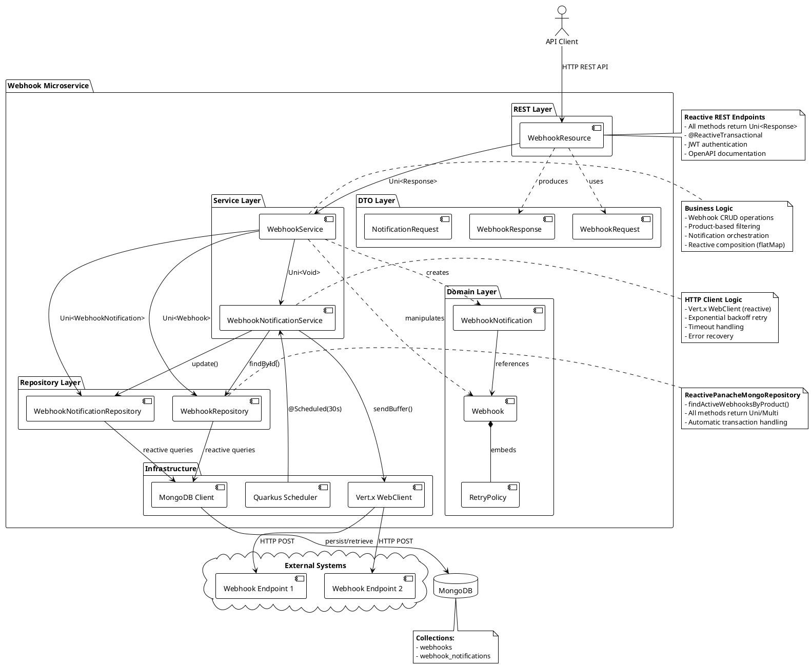
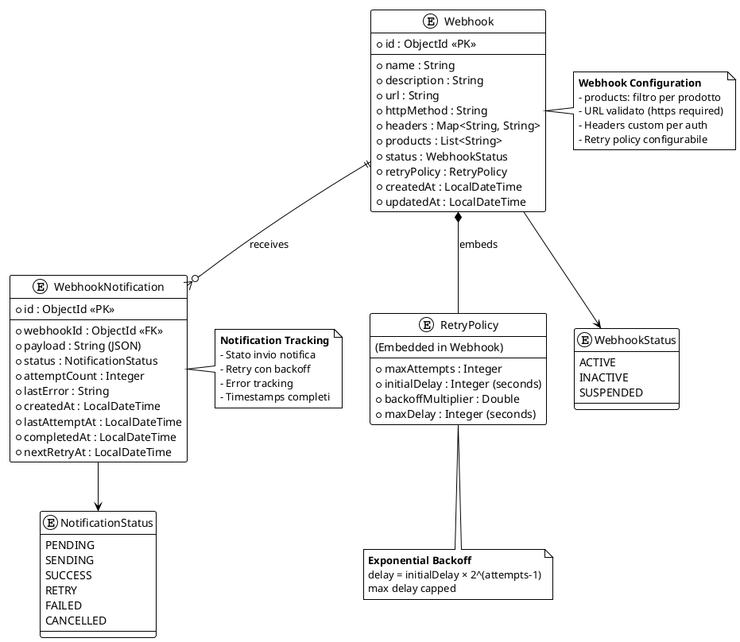

# Design Review - Sistema di Notifiche Webhook

**Versione:** 1.0  
**Data:** 31 Ottobre 2025  
**Autore:** Team Self Care  
**Stato:** In Revisione

---

## 1. Esigenza

### 1.1 Contesto
Il sistema Self Care necessita di un meccanismo affidabile e scalabile per notificare eventi e cambiamenti di stato a sistemi esterni in tempo reale. Attualmente, i sistemi esterni devono effettuare polling periodico per verificare aggiornamenti, causando:

- **Latenza elevata** nella propagazione delle informazioni
- **Carico non necessario** sui sistemi con richieste ripetute
- **Complessità implementativa** per i client esterni
- **Inefficienza** nell'utilizzo delle risorse

### 1.2 Problema da Risolvere
I servizi esterni integrati con Self Care (es. sistemi di terze parti, dashboard amministrative, piattaforme di gestione) necessitano di ricevere notifiche push per:

- Eventi di autenticazione (login, logout, cambio password)
- Modifiche ai profili utente
- Operazioni amministrative (creazione/modifica enti)
- Eventi di business specifici per prodotto

### 1.3 Requisiti Funzionali
- **RF-01**: Registrazione di endpoint webhook con URL, metodo HTTP e headers personalizzati
- **RF-02**: Filtraggio delle notifiche per prodotto (es. `PROD-IAM`, `PROD-AUTH`)
- **RF-03**: Invio di notifiche HTTP a webhook registrati quando si verificano eventi rilevanti
- **RF-04**: Politica di retry automatico con backoff esponenziale in caso di fallimento
- **RF-05**: Tracking dello stato delle notifiche (pending, sending, success, failed, retry)
- **RF-06**: Disattivazione automatica di webhook che falliscono ripetutamente
- **RF-07**: API REST per gestione CRUD dei webhook

### 1.4 Requisiti Non Funzionali
- **RNF-01**: Scalabilità - supportare migliaia di webhook attivi
- **RNF-02**: Affidabilità - garantire consegna delle notifiche con retry
- **RNF-03**: Performance - invio asincrono senza bloccare il flusso principale
- **RNF-04**: Resilienza - gestione fallimenti temporanei e permanenti
- **RNF-05**: Osservabilità - logging e tracing completo delle operazioni
- **RNF-06**: Sicurezza - autenticazione JWT per API, validazione URL webhook

---

## 2. Esito Atteso dell'Iniziativa

### 2.1 Obiettivi
Al completamento dell'iniziativa, il sistema Self Care avrà:

1. **Microservizio Webhook autonomo** e indipendente dagli altri moduli
2. **Notifiche in tempo reale** verso sistemi esterni con latenza < 1 secondo
3. **Riduzione del 90% del traffico di polling** verso le API Self Care
4. **Tasso di consegna > 99.5%** delle notifiche grazie al sistema di retry
5. **Modello di programmazione reattivo** per gestire carichi elevati con risorse limitate

### 2.2 Metriche di Successo
| Metrica | Target | Baseline Attuale |
|---------|--------|------------------|
| Latenza notifica (p95) | < 1s | N/A (polling 30s) |
| Throughput notifiche | > 1000 msg/s | N/A |
| Tasso di consegna | > 99.5% | N/A |
| Tempo recupero fallimenti | < 5 min | N/A |
| Risorse CPU (idle) | < 10% | N/A |

### 2.3 Benefici Attesi
- **Per i Client Esterni**: notifiche immediate, implementazione semplificata, riduzione complessità
- **Per Self Care**: riduzione carico API, migliore user experience, estensibilità del sistema
- **Per le Operations**: osservabilità migliorata, gestione centralizzata integrazioni

---

## 3. Design di Alto Livello

### 3.1 Architettura Generale

Il sistema webhook è progettato come microservizio autonomo all'interno del monorepo Self Care, con le seguenti caratteristiche:

- **Pattern architetturale**: Event-Driven + Repository Pattern
- **Modello di programmazione**: Reactive (Quarkus + Mutiny)
- **Persistenza**: MongoDB per webhook config e tracking notifiche
- **Comunicazione**: REST API per gestione + HTTP client per invio notifiche
- **Scheduling**: Quarkus Scheduler per retry automatico

### 3.2 Componenti Principali

#### 3.2.1 Webhook Resource (REST Controller)
Espone le API REST per:
- Registrazione webhook: `POST /webhooks`
- Lista webhook: `GET /webhooks`
- Dettaglio webhook: `GET /webhooks/{id}`
- Modifica webhook: `PUT /webhooks/{id}`
- Cancellazione webhook: `DELETE /webhooks/{id}`
- Invio notifica: `POST /webhooks/notify`

#### 3.2.2 Webhook Service (Business Logic)
Gestisce la logica di business:
- Validazione dati webhook
- Matching webhook per prodotto
- Creazione record di notifica
- Orchestrazione invio
- Gestione stato lifecycle

#### 3.2.3 Webhook Notification Service (HTTP Client)
Responsabile dell'invio effettivo:
- Invio HTTP request reattivo con Vert.x WebClient
- Gestione retry con backoff esponenziale
- Timeout e circuit breaker
- Logging errori e successi

#### 3.2.4 Repository Layer
Accesso ai dati con Panache Reactive:
- `WebhookRepository`: CRUD webhook
- `WebhookNotificationRepository`: CRUD notifiche e query per retry

#### 3.2.5 Entities
- **Webhook**: configurazione endpoint (url, httpMethod, headers, products, retryPolicy)
- **WebhookNotification**: tracking notifica singola (payload, status, attempts, timestamps)
- **RetryPolicy**: configurazione retry (maxAttempts, initialDelay, backoffMultiplier)

### 3.3 Flussi Principali

#### Flusso 1: Registrazione Webhook
```
Client → POST /webhooks → WebhookResource → WebhookService → WebhookRepository → MongoDB
```

#### Flusso 2: Invio Notifica
```
Event Source → POST /webhooks/notify
    ↓
WebhookService.sendNotification(productId, payload)
    ↓
Repository.findActiveWebhooksByProduct(productId)
    ↓
Per ogni webhook: crea WebhookNotification(PENDING)
    ↓
WebhookNotificationService.processNotification()
    ↓
Vert.x WebClient → HTTP POST → External System
    ↓
Success: status=SUCCESS | Failure: status=RETRY/FAILED
```

#### Flusso 3: Retry Automatico
```
Scheduler (ogni 30s) → findPendingNotifications()
    ↓
Per ogni notifica con nextRetryAt < now:
    ↓
WebhookNotificationService.processNotification()
    ↓
Calcola backoff: initialDelay * 2^(attempts-1)
    ↓
Success: DELIVERED | Max attempts: FAILED
```

---

## 4. Vista Statica

### 4.1 Diagramma delle Dipendenze

```plantuml
@startuml webhook-dependencies
!theme plain

package "Webhook Microservice" {
    [webhook-app]
}

package "Self Care Libraries" {
    [selfcare-sdk-security]
}

package "Quarkus Platform 3.28.3" {
    [quarkus-rest]
    [quarkus-mongodb-panache-reactive]
    [quarkus-vertx]
    [quarkus-vertx-web-client]
    [quarkus-smallrye-jwt]
    [quarkus-scheduler]
    [quarkus-reactive-routes]
}

package "SmallRye Reactive" {
    [smallrye-mutiny]
    [smallrye-mutiny-vertx-web-client]
}

package "External Dependencies" {
    [lombok]
    [mapstruct]
    [jackson]
}

database "MongoDB" {
    [webhooks-collection]
    [webhook-notifications-collection]
}

cloud "External Systems" {
    [webhook-endpoint-1]
    [webhook-endpoint-2]
    [webhook-endpoint-n]
}

[webhook-app] --> [selfcare-sdk-security]
[webhook-app] --> [quarkus-rest]
[webhook-app] --> [quarkus-mongodb-panache-reactive]
[webhook-app] --> [quarkus-vertx]
[webhook-app] --> [quarkus-vertx-web-client]
[webhook-app] --> [quarkus-smallrye-jwt]
[webhook-app] --> [quarkus-scheduler]
[webhook-app] --> [smallrye-mutiny]
[webhook-app] --> [smallrye-mutiny-vertx-web-client]
[webhook-app] --> [lombok]
[webhook-app] --> [mapstruct]

[quarkus-mongodb-panache-reactive] --> [MongoDB]
[quarkus-vertx-web-client] --> [webhook-endpoint-1]
[quarkus-vertx-web-client] --> [webhook-endpoint-2]
[quarkus-vertx-web-client] --> [webhook-endpoint-n]

note right of [webhook-app]
  Reactive Quarkus Application
  - REST API: gestione webhook
  - Scheduler: retry notifiche
  - HTTP Client: invio notifiche
end note

note right of [MongoDB]
  Collections:
  - webhooks: configurazioni
  - webhook_notifications: tracking
end note

@enduml
```



### 4.2 Diagramma dei Componenti



### 4.3 Diagramma delle Entità (ER)



---

## 5. Design Dettagliato

### 5.1 Modello di Programmazione Reattivo

Il microservizio utilizza **programmazione reattiva** con Quarkus e SmallRye Mutiny per:

1. **Non-blocking I/O**: tutte le operazioni (DB, HTTP) sono asincrone
2. **Backpressure**: gestione automatica del flusso di notifiche
3. **Composizione**: operazioni concatenate con `flatMap`, `onItem()`, `onFailure()`
4. **Scalabilità**: gestione migliaia di connessioni con pochi thread

**Esempio di flusso reattivo:**
```java
// Service Layer
public Uni<Void> sendNotification(NotificationRequest request) {
    return webhookRepository
        .findActiveWebhooksByProduct(request.getProductId())
        .onItem().transformToUni(webhooks -> {
            List<Uni<WebhookNotification>> notifications = webhooks.stream()
                .map(webhook -> createNotification(webhook, request.getPayload()))
                .toList();
            return Uni.join().all(notifications).andFailFast();
        })
        .onItem().transformToUni(notifications -> 
            processNotifications(notifications))
        .replaceWithVoid();
}
```

### 5.2 Gestione Retry

**Strategia di Retry con Backoff Esponenziale:**

```
Attempt 1: 0s (immediato)
Attempt 2: initialDelay × 2^0 = 30s
Attempt 3: initialDelay × 2^1 = 60s
Attempt 4: initialDelay × 2^2 = 120s
Attempt 5: initialDelay × 2^3 = 240s (capped a maxDelay)
```

**Stati della notifica:**
- `PENDING`: creata, in attesa di invio
- `SENDING`: invio in corso
- `SUCCESS`: consegnata con successo
- `RETRY`: fallita, verrà ritentata
- `FAILED`: fallita dopo maxAttempts
- `CANCELLED`: webhook disattivato

### 5.3 Sicurezza

1. **Autenticazione API**: JWT token con SmallRye JWT
2. **Autorizzazione**: controllo permessi per operazioni CRUD
3. **Validazione URL**: solo HTTPS per webhook URL (eccetto localhost dev)
4. **Rate Limiting**: protezione contro abusi (future enhancement)
5. **Signature Verification**: header X-Webhook-Signature per client (future)

### 5.4 Osservabilità

1. **Logging strutturato**: tutti gli eventi con context (webhookId, notificationId)
2. **Metriche**: contatori successi/fallimenti, latenza invio
3. **Tracing**: correlazione request con Quarkus OpenTelemetry (future)
4. **Health checks**: endpoint `/q/health` per liveness/readiness

---

## 6. Strategie di Deployment

### 6.1 Containerizzazione
- **Base image**: UBI 8 minimal
- **Multi-stage build**: Maven build + native Quarkus (opzionale)
- **Size**: ~150MB (JVM) / ~50MB (native)

### 6.2 Scalabilità Orizzontale
- **Stateless**: nessuno stato in memoria
- **Replica set MongoDB**: persistenza affidabile
- **Load balancing**: NGINX/Azure Application Gateway

### 6.3 Configurazione
Parametri configurabili via environment variables:
- `MONGODB_URI`: connection string MongoDB
- `WEBHOOK_TIMEOUT_CONNECT`: timeout connessione HTTP (default: 5000ms)
- `WEBHOOK_TIMEOUT_READ`: timeout lettura HTTP (default: 10000ms)
- `WEBHOOK_RETRY_INTERVAL`: intervallo scheduler retry (default: 30s)

---

## 7. Rischi e Mitigazioni

| Rischio | Impatto | Probabilità | Mitigazione |
|---------|---------|-------------|-------------|
| Webhook endpoint lento blocca sistema | Alto | Media | Timeout aggressivi, circuit breaker |
| MongoDB overload con molte notifiche | Alto | Bassa | Indici ottimizzati, pooling connessioni |
| Retry storm dopo outage | Medio | Media | Jitter nel backoff, rate limiting |
| Perdita notifiche per crash | Alto | Bassa | Persistenza immediata, replica set |
| DDoS via registrazione webhook | Medio | Media | Validazione URL, rate limiting API |

---

## 8. Prossimi Passi

### Fase 1: MVP (Completata)
- [x] Setup progetto Quarkus
- [x] Entità e repository MongoDB
- [x] API REST CRUD webhook
- [x] Service layer con logica business
- [x] HTTP client reattivo
- [x] Sistema retry automatico

### Fase 2: Hardening (In corso)
- [ ] Test unitari e integration test
- [ ] Test di carico (JMeter/Gatling)
- [ ] Documentazione API completa
- [ ] Build e deployment pipeline

### Fase 3: Enhancement (Future)
- [ ] Signature verification per client
- [ ] Rate limiting e throttling
- [ ] Dashboard amministrativa
- [ ] Metriche e alerting avanzati
- [ ] Support per altri protocolli (gRPC, WebSocket)

---

## 9. Conclusioni

Il microservizio Webhook rappresenta un'evoluzione significativa dell'architettura Self Care, introducendo:

1. **Comunicazione event-driven** verso sistemi esterni
2. **Modello reattivo** per scalabilità e performance
3. **Affidabilità** tramite retry intelligente e tracking completo
4. **Estensibilità** per supportare nuovi prodotti e integrazioni

Il design proposto bilancia **semplicità implementativa** con **robustezza operativa**, garantendo una soluzione production-ready che può crescere con le esigenze del business.

---

**Approvazioni:**

| Ruolo | Nome | Data | Firma |
|-------|------|------|-------|
| Tech Lead | | | |
| Architect | | | |
| Product Owner | | | |

